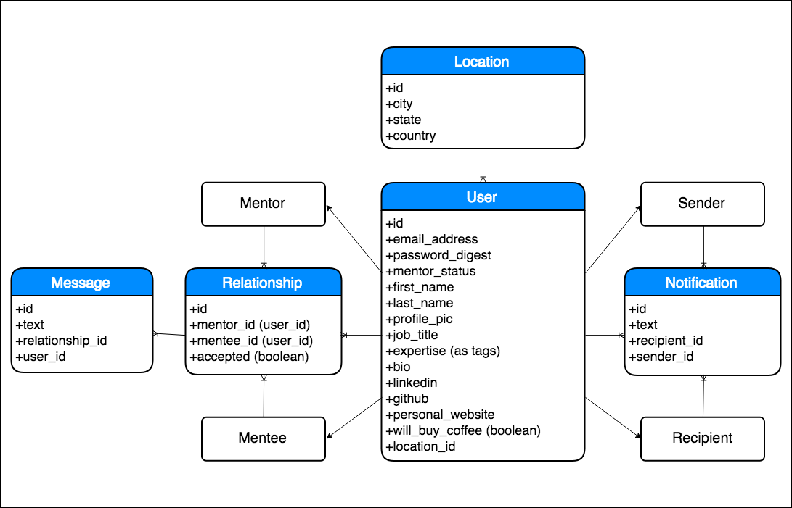

# Hatch

### The Gist of It

Hatch is a web application that helps you develop your professional network in a meaningful way. If you would like to be a mentor, you can sign up to be one and you will show up on the 'Browse All Mentors' page where potential mentees can then request your mentorship. Once the mentor accepts the request, the mentor and mentee can chat and make plans to meet up in person, schedule a phone call, exchange their email addresses, or make other arrangements they see fit.

### The Tech that Holds It All Together

##### [Backend](https://github.com/linsuri/hatch-backend)

* Rails API
* PostgreSQL
* ActiveRecord associations
* Action Cable
* JWT

##### [Frontend](https://github.com/linsuri/hatch-frontend)

* React
* Redux
* Material-UI

### ActiveRecord Associations

### Want to Play with It?

1. Follow on the links for both the frontend and backend
2. Clone both of them down into separate folders on your computer
3. In the command line, `cd` into the backend folder and run `rails s`
3. In the command line, `cd` into the backend folder and run `npm start` on another port if it is trying to use the same port as the backend
